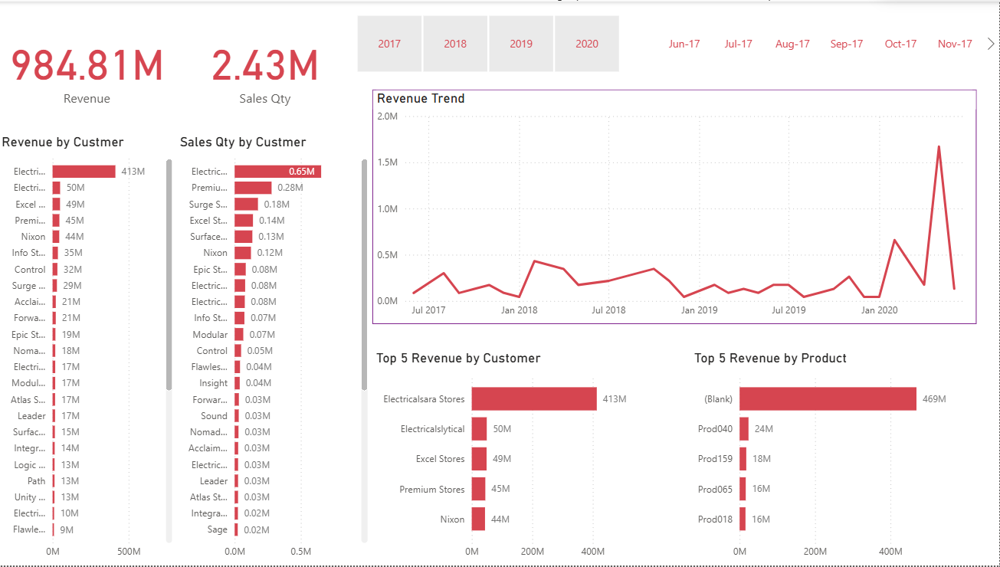

# Sales Insights Dashboard using Power BI

## Project Overview
This project presents an interactive Sales Insights Dashboard developed using Power BI to analyze business sales performance, revenue trends, customer contribution, and product-level performance. The dashboard enables data-driven decision-making through dynamic visualizations and KPI reporting.

## Objectives
- Monitor overall sales performance
- Analyze revenue trends over time
- Identify high-performing customers and products
- Track sales quantity and revenue distribution
- Build an interactive business intelligence dashboard

## Dataset Information
The dashboard is developed using sales-related datasets containing customer, product, market, transaction, and date information.

### Data Tables Used
- Sales Customers
- Sales Products
- Sales Transactions
- Sales Markets
- Sales Date

### Key Data Fields
- Customer Name
- Product Name
- Revenue
- Sales Quantity
- Transaction Date
- Market Information
- Product Category

## Tools & Technologies Used
- Power BI
- Power Query
- DAX
- Data Visualization
- Business Intelligence Reporting

## Dashboard Features
- Interactive filters and slicers
- Year-wise and month-wise analysis
- Revenue trend visualization
- Customer-level sales insights
- Product performance analysis
- KPI summary cards
- Top customer and product analysis

## Key Performance Indicators (KPIs)

The dashboard tracks the following KPIs:

- Total Revenue: 984.81M
- Total Sales Quantity: 2.43M

## Dashboard Insights

### Revenue Trend Analysis
- Revenue trends are monitored across different periods
- Time-based analysis helps identify business growth and fluctuations

### Revenue by Customer
- Customer-wise revenue analysis highlights major revenue contributors
- Enables identification of high-value customers

### Sales Quantity by Customer
- Displays customer contribution based on sales quantity
- Helps understand customer purchasing patterns

### Top 5 Revenue by Customer
- Identifies top-performing customers generating maximum revenue
- Supports customer-focused business strategy

### Top 5 Revenue by Product
- Highlights products contributing the highest revenue
- Helps understand product demand and performance

## Dashboard Preview



## Project Outcome
This dashboard provides a comprehensive sales performance analysis solution by combining revenue tracking, customer insights, and product analytics. It supports data-driven business decisions through interactive and visually informative reporting.

## Repository Structure
```text
Sales-Insights-Dashboard-PowerBI/
│
├── Sales_Insights.pbix
├── README.md
├── Dashboard.png

```

## Future Enhancements
- Regional sales analysis
- Profit and margin analysis
- Forecasting and predictive insights
- Advanced customer segmentation
